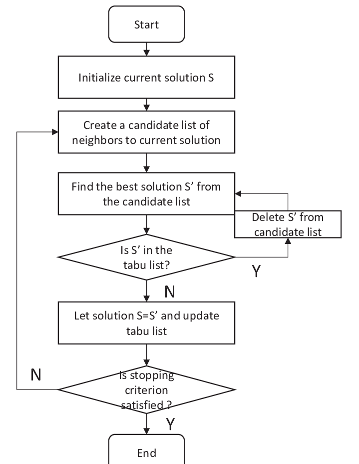

# Optimizing College Course Scheduling with Tabu Search Algorithm
### By Olga Pidruchna and Madison Tong

## **Overview**

### **What is it?**

The tabu search (TS) algorithm is a type of metaheuristic optimization algorithm created by Fred Glover in 1986. It belongs to the field of local search algorithms. Unlike other algorithms, its design allows it to escape local optima by maintaining a memory structure, called a "tabu list," of recently visited solutions that it is not allowed to return to for a specified number of iterations. The origin of its name, "tabu," is a Tongan word that means things that cannot be touched because they are sacred.1 The TS algorithm was designed in a time where for an algorithm to be considered 'intelligent', it had to incorporate either 'adaptive memory' or 'responsive exploration' into it.2

One strength of tabu search is its ability to escape local optima by 'tabu-ing' certain solutions to travel to. This allows the algorithm to explore worse solutions and not cycle back to previously visited solutions. Additionally, it is good not only in local search but global optimization as well, since the algorithm is built in a way to allow further exploration of both promising areas and new areas in the solution space. Tabu search is also flexible and can be easily adapted to various optimization problems.

On the other hand, this algorithm can be sensitive to its parameter tuning, specifically the size of the tabu list. This algorithm may also require a high number of iterations to converge to a high quality solution, which can make it computationally intensive. It may also struggle with highly constrained problems or problems with a large number of local optima.

Despite these limitations, tabu search is a highly flexible and adaptable algorithm, allowing it to be compatible with the vast majority of optimization problems (problems involving maximizing or minimizing).

Some examples of common problems used with TS are: 3

- Supply chain management
- Vehicle routing
- Data mining
- Traveling Salesman Problem
- DNA sequencing
- Minimum Spanning Tree (MST)

### **Design Decisions**

When implementing a tabu search algorithm, there are many design decisions that need to be made to make the algorithm fit your needs.

#### Tabu Tenure  
This is the number of iterations for which a move or solution remains in the tabu list. It should be set based on the size and complexity of the problem. A smaller tabu tenure allows for more exploration but may lead to cycling, as previously visited solutions become available again sooner. A larger tabu tenure encourages diversification but may slow the search.

#### Aspiration Criteria  
This is a set of rules that determine whether you can allow a move that is tabu. A common aspiration criteria is to allow a tabu move if it leads to a solution better than the best solution found so far. Another is to allow a tabu move if it has not been visited for a certain number of iterations.

#### Stopping Criteria  
This is when the search stops and the best solution found up to that point is returned. There are multiple criteria that can be used that yield different results:

- Maximum number of iterations
- Solution quality
- Time limit
- No improvement

If a short runtime is important, setting a time limit makes sense for stopping criteria. If runtime is not important, and the most important thing is solution quality, then you can set a specified satisfactory level as stopping criteria. You can also combine multiple criteria to best fit what you are using the algorithm for. A common practice is to set a maximum number of iterations based on the problem size and complexity, and to terminate the algorithm if no improvement has been made for a specified number of consecutive iterations.

#### Neighborhood Structure   
This is how you find determine neighbors. This is highly problem-specific and can have significant impact on the performance. The neighborhood size should be large enough that you explore diverse set of solutions, but not too large to slow down the search.

### **How it works**

The basic process of tabu search is as follows:

1. Generate an initial/current solution x and set current_best = x. This does not have to necessarily be a good solution.
2. Initialize an empty tabu list
3. While the stopping criteria hasn't been met, rerun steps a to e:  
    *a*. Explore the list of neighboring solutions N(x).  
    *b*. Choose a solution x' that is not only the best one of the list, but is not included on the tabu list.  
    *c*. If no solutions exist that are not tabu and are improving, then you can go into the tabu list and choose a solution so long as it meets the aspiring criteria.  
    *d*. update x = x'.  
    *e*. Add the new x value to the tabu list and set current_best to x if it is the best solution. If tabu list has reached the tabu tenure, remove the earliest solution from the list.
4. Return current_best.

Here is an additional diagram to visualize this process: 4

## **Application: Course Scheduling**

The application we chose is college course scheduling. We wanted to create an algorithm that would assign the courses running in a semester to time slots in such a way that the maximum amount of students are able to enroll in their preferred courses without time conflicts. Tabu search can be applied to this problem to search for an optimal course schedule with the least amount of student schedule conflicts without getting stuck in local maxima.

The inputs for our algorithm are:

- The courses that will be offered
- The time slots that courses can be placed in
- A mapping of students and their preferred classes

We also have constraints for a valid schedule:

- SCOPE must be run on Wednesday
- First year classes cannot be on Wednesday
- Any given time slot cannot have more than 3 classes

The way we evaluate a solution is by finding how many preferred courses are _non-conflicting_ across all students, and dividing it by the number of total preferred courses across all students.

### **Assumptions**

Our application of this algorithm abstracts some details regarding the problem. We assume that the courses all have classrooms to run in and faculty to teach who don't also have a conflicting schedule. The algorithm also assumes that the number of courses is less than or equal to 3 times the number of time slots. This is because we have a constraint that doesn't allow more than 3 classes per time slot, and we have no checks to ensure that we do not have to schedule more classes than there are possible slots. 

In regards to assumptions with the tabu search algorithm itself, the algorithm runs on the assumption that there are local optima that must be avoided within the solution space. This is why it includes a tabu list. However if the solution space only includes a global optima, then the tabu list wouldn't be needed since there are no local optima to avoid. 

### **Other Use Cases**

This algorithm can be modified to be used in many different scheduling problems. For example, it can be used for job scheduling or task scheduling. It could also be used for spatial allocation, such as organizing stock in a warehouse, or resource allocation, such as in the healthcare system.

## **Ethical Analysis**

As with all heuristic algorithms, the way that you set up parameters highly impacts the outcomes you get. If the input data contains bias, this can unintentionally created biased results. Additionally if an objective function is created to weigh a certain factor more than others, this may also have intentional biased effects. In applications such as resource allocation in hospitals, for example, biased results can even be detrimental to certain groups of patients who may be deprived of aid. In the cases of more socially nuanced problems, such as creating social policies or anything that may have impactful decisions such as disaster relief responses, the tabu search algorithm may not be taking every factor into consideration. 

These concerns can be mitigated by manually checking your data beforehand and considering what biases may arise from the information presented. Additionally, having humans consider how to craft the objective function and ponder who may be affected by weighing one factor more than another will help to decrease risks of harmful effects.

## Resources 
1. https://en.wikipedia.org/wiki/Tabu_search 
2. https://www.researchgate.net/publication/228346477_Tabu_Search
3. https://algorithmafternoon.com/stochastic/tabu_search/  
https://www.researchgate.net/publication/228346477_Tabu_Search
4. https://www.researchgate.net/publication/320508257_Intra-Platoon_Vehicle_Sequence_Optimization_for_Eco-Cooperative_Adaptive_Cruise_Control  

#### Libraries Used:
- random
- matplotlib
